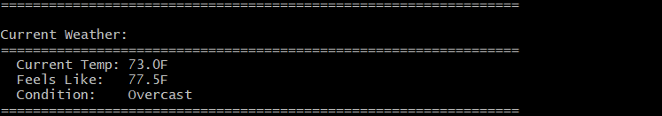

A command line weather forecast application, built to pratice working with APIs and request data, filter and formating to a clean experience for the end user.

=== The API data will be sourced from WeatherAPI.com ===

_In the future, this app may include a weather history system and more data within its format in later implemenatations._

Day to day forecast

Current weather

